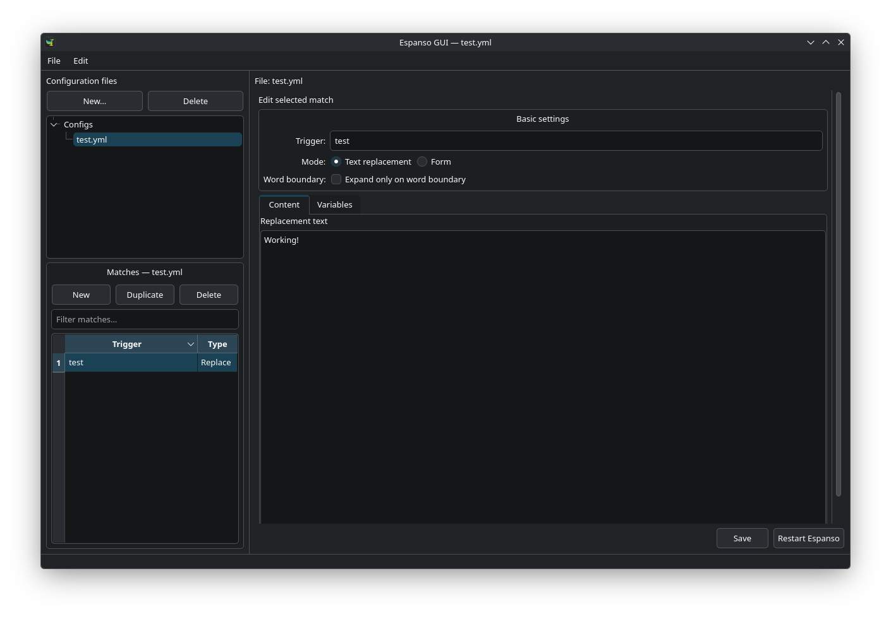

# Espanso GUI

A native desktop editor for [Espanso](https://espanso.org/) match files. Espanso
GUI makes it easier to create, review, and maintain text-expansion rules without
editing YAML by hand, while keeping your existing Espanso configuration in
control.

> Espanso GUI is an independent project and is not affiliated with Espanso.



## Features

- Browse, create, duplicate, and delete Espanso match files
- Create and edit replacement matches, forms, form fields, and variables
- Work with shell, script, form, and choice variables
- Preserve additional supported YAML fields when saving match files
- Edit and validate the complete YAML document in Expert YAML mode
- Edit Espanso's default and app-specific configuration profiles
- Restart Espanso directly after saving changes

## Installation

Install [Espanso](https://espanso.org/install/) first. Espanso GUI automatically
locates its `match` directory and edits the same files used by Espanso.

### Debian and Ubuntu

Download the `.deb` file from the project's [Releases](https://github.com/johannjdk/espanso-gui-qt/releases)
page, then install it locally:

```bash
sudo apt install ./espanso-gui-qt-all.deb
```

### Arch Linux

Download the `.pkg.tar.*` file from the [Releases](https://github.com/johannjdk/espanso-gui-qt/releases)
page and install it with pacman:

```bash
sudo pacman -U ./espanso-gui-qt-any.pkg.tar.zst
```

### macOS

Download the DMG that matches your Mac from the [Releases](https://github.com/johannjdk/espanso-gui-qt/releases)
page:

- Apple silicon (M1 and newer): `espanso-gui-qt-macos-arm64.dmg`
- Intel Mac: `espanso-gui-qt-macos-x64.dmg`

Open the DMG and drag **Espanso GUI** to the Applications folder.

### Run from source

Requirements: Python 3.10 or newer, PySide6, and PyYAML.

```bash
git clone https://github.com/johannjdk/espanso-gui-qt.git
cd espanso-gui-qt
python -m venv .venv
source .venv/bin/activate
pip install -e .
espanso-gui-qt
```

## How it works

The application discovers Espanso's `match` directory automatically:

- Linux: `~/.config/espanso/match` or `$XDG_CONFIG_HOME/espanso/match`
- macOS: `~/Library/Application Support/espanso/match`
- Windows: `%APPDATA%\\espanso\\match`

Choose a configuration file in the left panel, edit its matches, and click
**Save**. Use **Restart Espanso** when you want Espanso to reload the changes
immediately. Existing YAML is validated before Expert YAML changes are saved.

To edit how Espanso itself behaves, choose **File → Espanso configuration…**.
This opens the `config` directory, including `default.yml` and app-specific
profiles. The editor supports all Espanso YAML options, including application
filters and `includes`/`excludes` rules. Espanso does not apply app-specific
profiles on Wayland.

Run this command from the directory containing both the package and
`SHA256SUMS`.

## Contributing and support

Bug reports and feature requests are welcome in the
[issue tracker](https://github.com/johannjdk/espanso-gui-qt/issues). For a code
change, please open a pull request with a concise description and reproduction
or testing notes where relevant.
