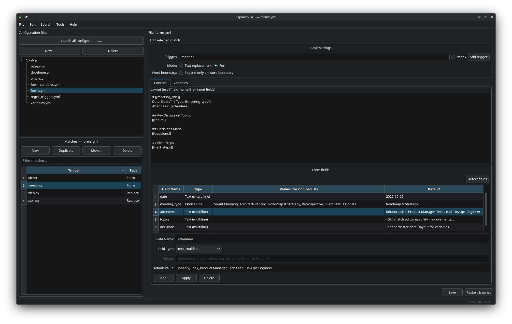
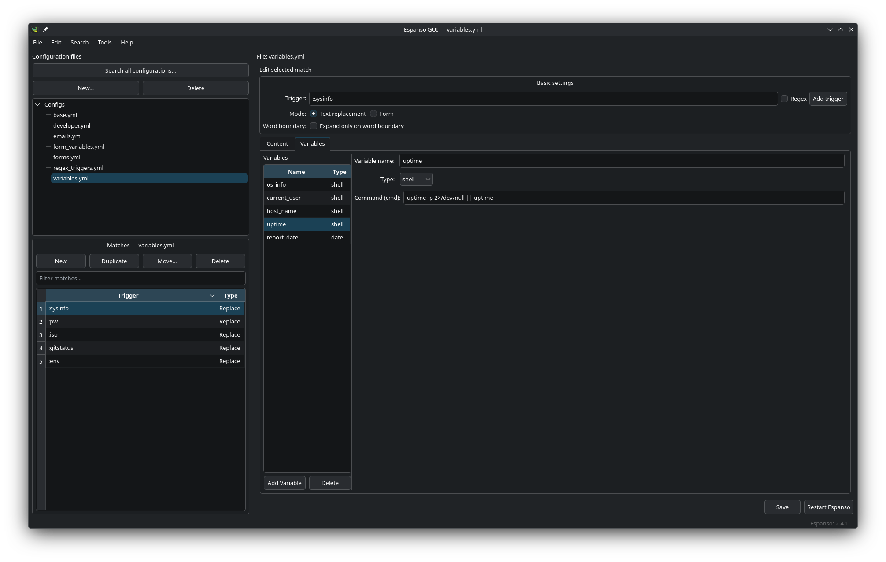
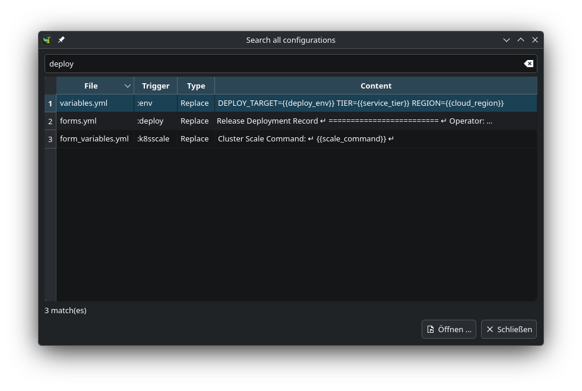
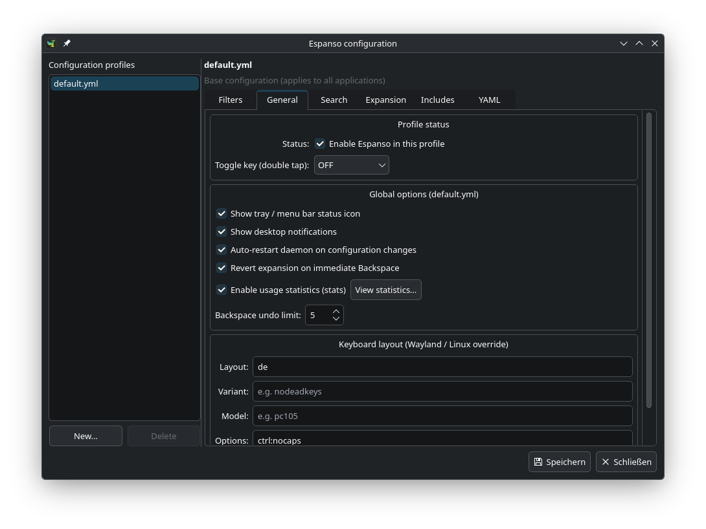
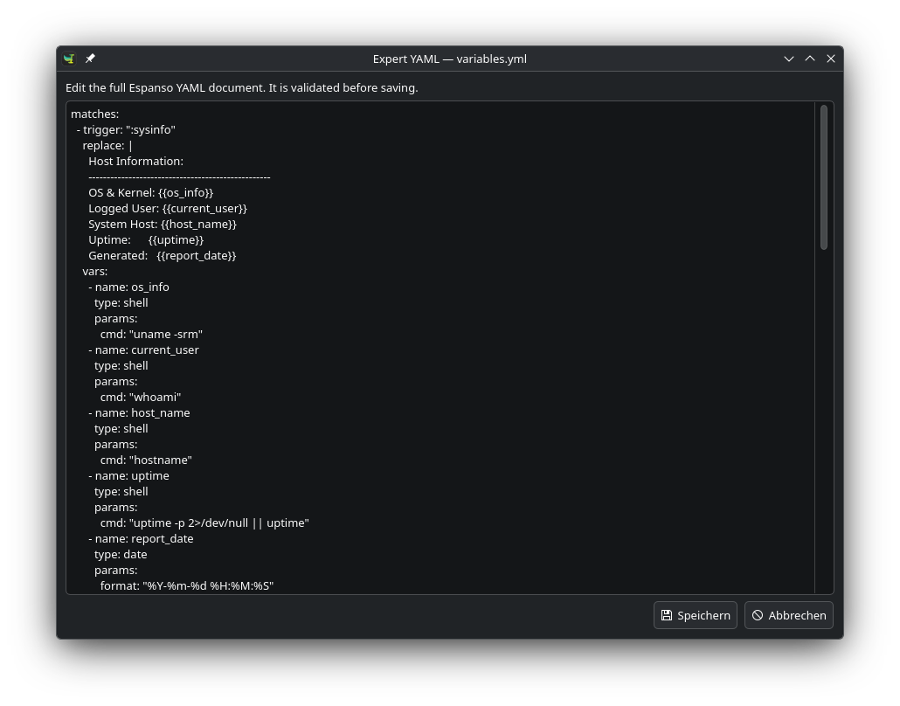
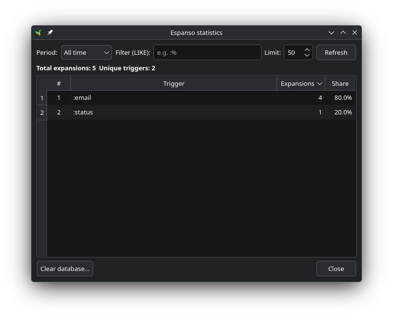

# Espanso GUI

Espanso GUI is a desktop editor for [Espanso](https://espanso.org/) match files. It provides a graphical way to maintain text-expansion rules while working with the same configuration files that Espanso uses.

Espanso GUI is an independent project and is not affiliated with Espanso.



## What it does

- Browse, create, rename, duplicate, move, and delete match files and matches
- Edit replacement matches, forms, form fields, and variables
- Work with shell, script, form, and choice variables
- Search and sort matches by trigger, type, or content
- Search across all match files and open a result directly with **Ctrl+F**
- Open the complete match-file YAML when an option is not exposed by the editor
- Manage Espanso's `default.yml` and application-specific configuration profiles
- Restart Espanso after saving changes

The graphical editor handles the common match types. Expert YAML mode is available for advanced Espanso options and validates the document before saving.

## Screenshots

### Main Window & Form Editor
Match editor with configuration file tree, trigger lists, form templates, and input fields:


### Variables & Form Fields
Master-detail variable manager for shell, script, date, choice, and form variables:



### Global Search (Ctrl+F)
Fast search across all configuration files with direct match navigation:



### Configuration Profiles
Visual settings for `default.yml`, keyboard layout overrides, and application filters:



### Expert YAML Editor
Full YAML document editor with syntax validation before saving:



### Expansion Statistics
Usage statistics, expansion counters, and Espanso version status:




## Installation

Install [Espanso](https://espanso.org/install/) first. Espanso GUI looks for its configuration directory automatically and does not create a separate set of match files.

### Linux

The install script supports Debian, Ubuntu, Arch Linux, Fedora, and compatible distributions. It downloads the latest release package and requires administrator access.

```bash
curl -fsSL https://raw.githubusercontent.com/johannjdk/espanso-gui/main/scripts/install-linux.sh | sh
```

Alternatively, download a package from the [releases page](https://github.com/johannjdk/espanso-gui/releases).

For Debian, Ubuntu, and Pop!_OS:

- **Standalone package (recommended for Ubuntu 22.04 / 24.04, Pop!_OS, Linux Mint):** Bundles all Python and Qt dependencies, solving missing `python3-pyside6` errors:
  ```bash
  sudo apt install ./espanso-gui-*-linux-debian-ubuntu-standalone.deb
  ```

- **Standard package (Ubuntu 24.10+, Debian 13+):** Uses system Python and Qt packages:
  ```bash
  sudo apt install ./espanso-gui-*-linux-debian-ubuntu.deb
  ```

### AppImage (Universal Linux)

Download `espanso-gui-*-linux-x86_64.AppImage` from the [releases page](https://github.com/johannjdk/espanso-gui/releases), make it executable, and run:

```bash
chmod +x ./espanso-gui-*-linux-x86_64.AppImage
./espanso-gui-*-linux-x86_64.AppImage
```

For Fedora:

```bash
sudo dnf install ./espanso-gui-*-linux-fedora-rhel.noarch.rpm
```

For Arch Linux:

```bash
sudo pacman -U ./espanso-gui-qt-*-linux-arch.pkg.tar.zst
```

The Arch package is named `espanso-gui-qt` to distinguish it from the unrelated `espanso-gui` package in the AUR. The application menu entry and `espanso-gui` command stay the same.

When upgrading from an older release of this project, install the renamed package with the command above and confirm removal of the conflicting `espanso-gui` package. Your Espanso configuration files are preserved. Future updates to this package are available from this project's releases; the unrelated AUR package is not an update source. Plain `pacman -Syu` does not fetch AUR updates, but AUR helpers can match locally installed packages by name.

### macOS

Download the appropriate DMG from the [releases page](https://github.com/johannjdk/espanso-gui/releases):

- Apple silicon: `espanso-gui-*-macos-arm64.dmg`
- Intel: `espanso-gui-*-macos-x64.dmg`

Open the DMG and move Espanso GUI to the Applications folder.

### Windows

Windows builds are made on Windows x64. With Python 3.10 or newer installed, run the following in PowerShell from the repository root:

```powershell
.\scripts\build-windows.ps1
```

The resulting archive is written to `dist/`. Extract it and start `Espanso GUI.exe`.

### Run from source

Python 3.10 or newer is required.

```bash
git clone https://github.com/johannjdk/espanso-gui.git
cd espanso-gui
python -m venv .venv
source .venv/bin/activate
pip install -e .
espanso-gui
```

## Using the application

The configuration directory is selected from the operating system:

| Platform | Match directory |
| --- | --- |
| Linux | `$XDG_CONFIG_HOME/espanso/match` or `~/.config/espanso/match` |
| macOS | `~/Library/Application Support/espanso/match` |
| Windows | `%APPDATA%\\espanso\\match` |

Select a file in the left panel, select a match, and save when finished. Use **Restart Espanso** to reload the configuration immediately. The restart action requires the `espanso` command to be available on your system.

Use **Search → Search all configurations…** or **Ctrl+F** to find matches across `.yml` and `.yaml` files, including subfolders. Search covers file names, triggers, full replacement text, forms, and variables, including unsaved edits in the current file. Open a result to select it in the editor. Unreadable files are listed in the search warning's tooltip.

For configuration profiles, open **File → Espanso configuration…**. `default.yml` applies everywhere; other profiles use Espanso filters such as `filter_exec`, `filter_class`, `filter_title`, or `filter_os`. Espanso does not support application-specific profiles on Wayland.

## Contributing

Bug reports and feature requests belong in the [issue tracker](https://github.com/johannjdk/espanso-gui/issues). Pull requests should describe the change and include reproduction or test notes where useful.

## License

Espanso GUI is licensed under the [GNU General Public License v3.0](LICENSE).

The application icon is derived from the Espanso project and is distributed under the same license. Espanso is a separate project; see its [license](https://github.com/espanso/espanso/blob/dev/LICENSE) for details.
